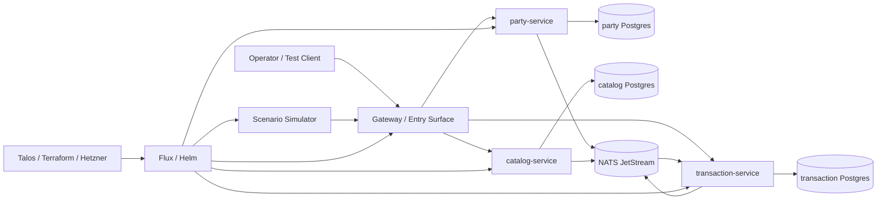

# Target Platform Architecture

## Purpose

Define the concrete runtime shape for the first credible implementation of `box`.

This document turns the contract-first ADR into an implementation target for:

- kernel services
- the scenario simulator
- the local runtime
- later GitOps deployment

## Guiding rules

1. Contracts are the source of truth for service behavior.
2. Every service owns its own persistence and publishes integration facts through events.
3. Cross-service behavior must happen through public API or event boundaries, never through private tables.
4. Scenario packs overlay business-specific semantics onto the kernel; they do not redefine service ownership.
5. Infra and GitOps are delivery machinery, not a place to hide business coupling.
6. Replacement-proof matters from the start: one service should be swappable for another conforming implementation.

## System layout

Notes:

- The gateway is intentionally thin. It can be skipped in early local development if direct service access keeps the kernel simpler.
- NATS JetStream is the shared transport, not shared business storage.
- Each service gets its own Postgres database or schema boundary. Shared cluster infrastructure does not relax that rule.

## Kernel service responsibilities

### `party-service`

Owns customer and organization identities.

Public responsibilities:

- create and list parties
- normalize optional contact fields
- emit `party.created`

Non-responsibilities:

- catalog lookups
- order processing
- cross-service reporting queries

### `catalog-service`

Owns offerings, price references, and item availability.

Public responsibilities:

- create and list catalog items
- validate price shape and currency
- emit `catalog.item.created`

Non-responsibilities:

- customer ownership
- order lifecycle
- scenario-specific pricing policy stored outside contracts

### `transaction-service`

Owns orders and sales-like transactions.

Public responsibilities:

- create and list orders
- validate order invariants against local reference views of parties and catalog items
- emit `order.created`

Non-responsibilities:

- becoming the source of truth for party or catalog data
- direct reads from other services' tables
- hardcoding scenario logic into core transaction rules

## Reference service internals

Each reference service should share the same internal shape:

1. Transport layer
   HTTP handlers built from the published OpenAPI contract.
2. Application layer
   Command handlers and query handlers that enforce service-local invariants.
3. Persistence layer
   Service-owned tables and repositories only for that bounded context.
4. Integration layer
   Outbox publisher for emitted events and inbox consumers for subscribed events.
5. Verification layer
   Contract tests, service-local tests, and example payload validation.

The important point is not the specific Python library stack; it is the separation between public contract, service logic, and integration plumbing.

## Integration patterns

### Command path

Use synchronous APIs for:

- direct operator commands
- deterministic simulator commands
- narrow service-owned reads

Do not use synchronous cross-service request chains as the default consistency mechanism for the kernel. In particular, `transaction-service` should validate against local reference views built from consumed events, not by reaching into `party-service` and `catalog-service` on every order write.

### Event path

Use asynchronous events for:

- propagating newly created business facts
- updating local read-side reference views in downstream services
- simulator audit and observability feeds later

Recommended patterns:

- producer outbox table so domain write and event publication are atomic from the producer's perspective
- consumer inbox or processed-event table so retries are idempotent
- consumer-owned projection tables for reference data needed locally

### Gateway pattern

The gateway should stay small and optional in the first kernel.

Good gateway responsibilities:

- auth and request shaping later
- API aggregation for demos
- routing and surface stability

Bad gateway responsibilities:

- embedding business rules from the services
- joining across private data stores
- becoming a hidden monolith

## Scenario simulation architecture

Scenario packs remain configuration overlays under `scenario-packs/`.

The simulator runtime should:

- load a scenario pack plus policy files
- derive deterministic commands from a seeded clock and policy model
- validate generated payloads against the same contracts services use
- send commands through public APIs or publish only contract-valid events when that boundary is explicitly part of the design
- record why payloads were generated or rejected

The simulator must not:

- seed private service tables directly
- add new business entities without a contract change
- let scenario-specific logic leak into kernel ownership boundaries

## Deployment model

### Local first

The first credible runtime target is local:

- services run as local processes or containers
- Postgres and NATS run through `infra/examples/compose.yaml`
- validation and tests run from `make validate`, `make test`, and `make verify-fast`

### Cluster later

Once the kernel and simulator behavior are stable:

- Terraform provisions Hetzner resources
- Talos defines the cluster chassis
- Flux composes CNPG, NATS, ingress, observability, kernel services, and simulator overlays

This ordering preserves the rule that infrastructure should deploy stable service boundaries rather than invent them.

## Replacement-proof implications

Design every service boundary as if another implementation will replace it later.

That means:

- contracts stay explicit and versioned
- tests target public behavior, not internal imports
- gateway and routing composition can switch providers without caller changes
- database schemas are private implementation details and never compatibility guarantees
